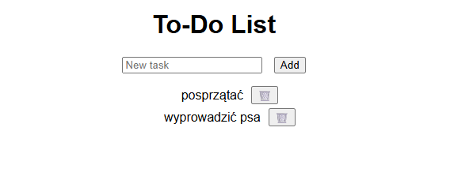

# Todo App 

Prosta aplikacja webowa typu „to-do list” do zarządzania zadaniami.  
Zbudowana w oparciu o Node.js, Express i MongoDB Atlas.

---

##  Funkcjonalności

- Dodawanie nowych zadań
- Wyświetlanie listy zadań
- Usuwanie zadań

---

## Technologie

- Node.js + Express (backend)
- MongoDB Atlas + Mongoose (baza danych)
- HTML, CSS, JavaScript (frontend)

---
## 🖼️ Zrzut ekranu aplikacji

Przed dodaniem zadań:

Po dodaniu zadań:

---
## Uruchom aplikację

